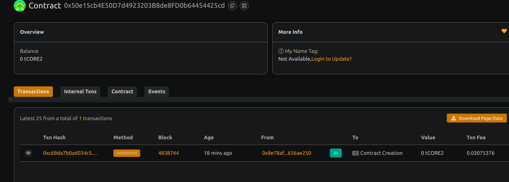

## Supply Chain Tracking for a Single Product Type

## Project Description

This smart contract provides a minimalistic on-chain supply chain tracker for a single product type. It captures and records the movement of a product from manufacturing to delivery, logging its status and current custodian at each stage.

# Project - Vision

To develop a transparent, tamper-resistant, and decentralized system that empowers all stakeholders in the supply chain to independently verify the status, location, and custody of products at any point. The system aims to enhance trust, ensure end-to-end traceability, and eliminate dependency on centralized intermediaries by leveraging secure and verifiable technologies.

## Key Features

- **Single Product Lifecycle Management**: Tracks a single product from manufacturing to delivery.
- **Status Transitions**: Status evolves through predefined stages—Manufactured, InTransit, Delivered.
- **Custody Validation**: Only the current holder can update the status and assign the next handler.

## Future Scope

Support tracking for multiple products via unique IDs.

Integration with QR code scanning and off-chain metadata (e.g., batch numbers, expiration dates).

Add timestamped audit trails for regulatory compliance and detailed analytics.

Develop a frontend dashboard for real-time product status visualization.

Implement role-based access control for manufacturers, transporters, retailers, etc.

## Contract details
0x50e15cb4E50D7d4923203B8de8FD0b64454425cd

